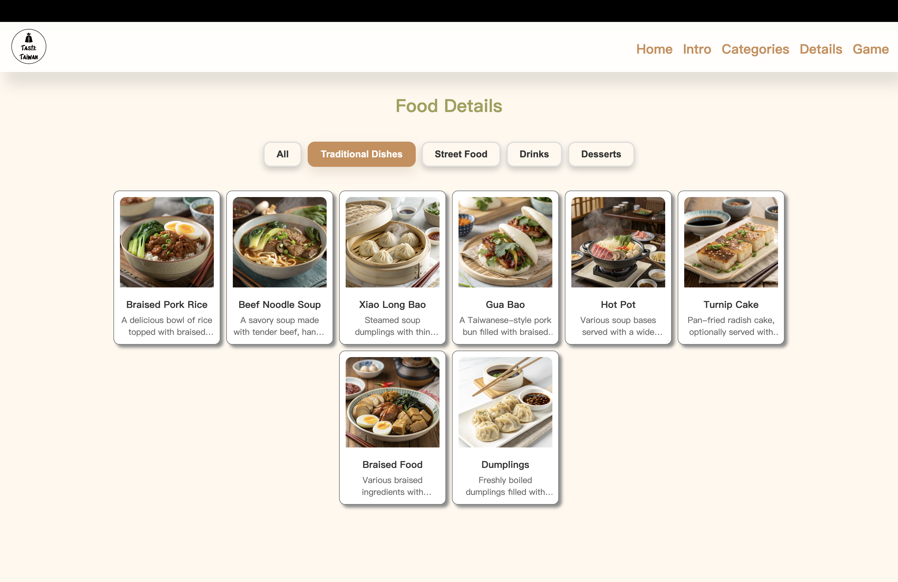
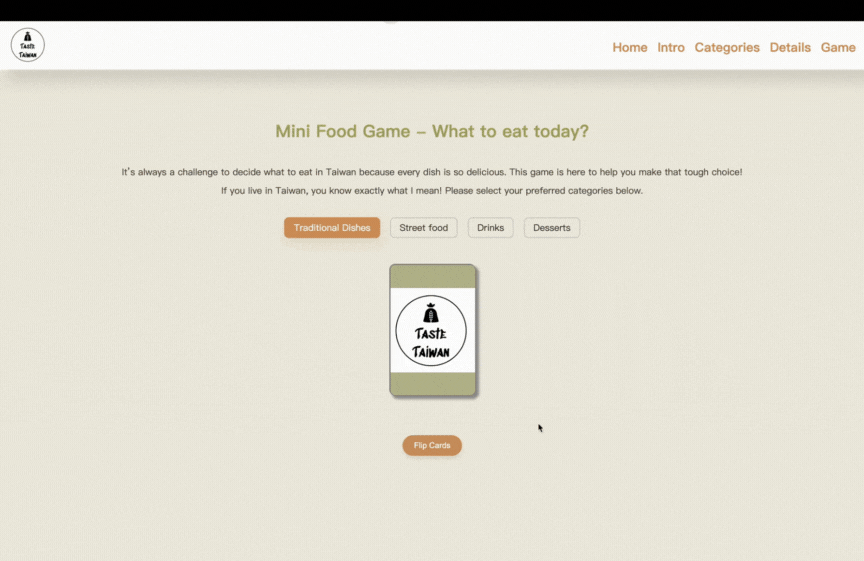

# Taste Taiwan
A website to discover Taiwan's culinary treasures

## Demo Link
Explore the website: [Taste Taiwan](https://jennywu3.github.io/Website_Taste_Taiwan/)

## Table of Content
- [About this project](#about-this-project)
- [Features](#features)  
- [Screenshots](#screenshots)
- [Technologies](#technologies)

## About this project
Taiwan is famous for its rich culinary culture, offering more than just bubble tea. This website introduces a variety of Taiwanese dishes and includes a fun mini-game that helps users decide "What to eat today?" by randomly suggesting meals.

The platform provides for locals seeking meal inspiration or international visitors eager to explore Taiwan’s delicious food scene. 

## Features
- **Explore Taiwanese Dishes**: View detailed descriptions of iconic Taiwanese foods, complete with images and cultural context.  
- **Responsive Design**: Optimized for desktops, tablets, and mobile devices.  
- **Interactive Mini-Game**: Engage with a playful feature that randomly suggests meals to simplify decision-making.  
   

## Screenshots

- ### Homepage
  

- ### Dish Showcase
  

- ### Mini Game
  

## Technologies
This project was built using: HTML, CSS and JavaScript

